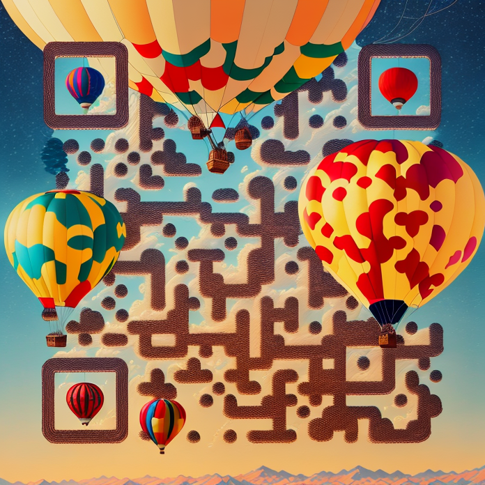

# AI-Image-Creator

此仓库用于生成 AI 图片，发送到 Telegram bot 生成[极简阅读站](https://daily-ai-draw.flyooo.uk/)，同时保存至 [Notion 公开页面](https://daily-ai-img.flyooo.uk/)。

1. 去 unsplash.com 随机获取一张图片，并保存其内容描述
2. 使用 Stable Diffusion 生成图片
3. 使用 Dall-E 生成图片
4. 使用 Midjourney 生成图片

本活动由公众号：程序杂念发起，下方是公众号二维码，如有任何想法及问题欢迎交流。

本站 Midjourney 绘图能力来自[慧言 AI](https://huiyan-ai.cn/)，点击前往[慧言 AI](https://huiyan-ai.cn/)。
